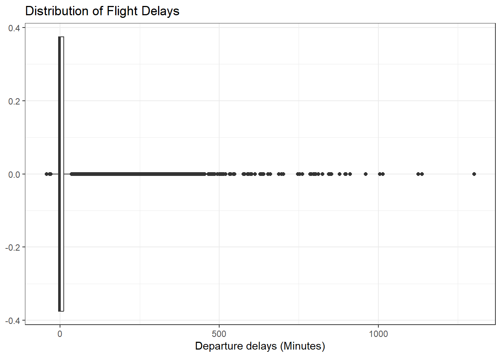

## Task


::: {.cell}

```{.r .cell-code}
library(nycflights13)
library(tidyverse)

flights <- flights %>%
  filter(
    !is.na(dep_delay),
    !is.na(carrier)
  )

# plot 1 univar carrier

ggplot(flights, aes(carrier)) + 
  geom_bar() +
  labs(title =  "Number of Flights per Carriers", x = "Carriers", y ="Count")+
  theme_bw()
```

::: {.cell-output-display}
{width=672}
:::

```{.r .cell-code}
# univar plot for delays
ggplot(flights, aes(dep_delay)) + 
  geom_boxplot() +
  labs(title = "Distribution of Flight Delays",
       x = "Departure delays (Minutes)")+
  theme_bw()
```

::: {.cell-output-display}
{width=672}
:::

```{.r .cell-code}
ggplot(flights, aes(carrier, dep_delay)) + geom_boxplot() + theme_bw()+ labs(title ="Flight Delays by Carriers", x = "Carrier", y = "Flight Delays in minutes")
```

::: {.cell-output-display}
{width=672}
:::
:::


The graphs above selects for the carriers that had the most delays in the data set. The graphs above shows that the carriers over all tend get to leave at a respectable time. This is important because the many parts of logistics has to do with getting people to their next flight. The chart above simply shows us that outliers exist for all of the major carriers at this airport. This may not seem the case, but some carriers don't have as many flights as others so over the course of the year they will experience more delays in departures. To evaluate the Carriers one should divide the median delay departure time by the number of flights to get a standardized metric.
