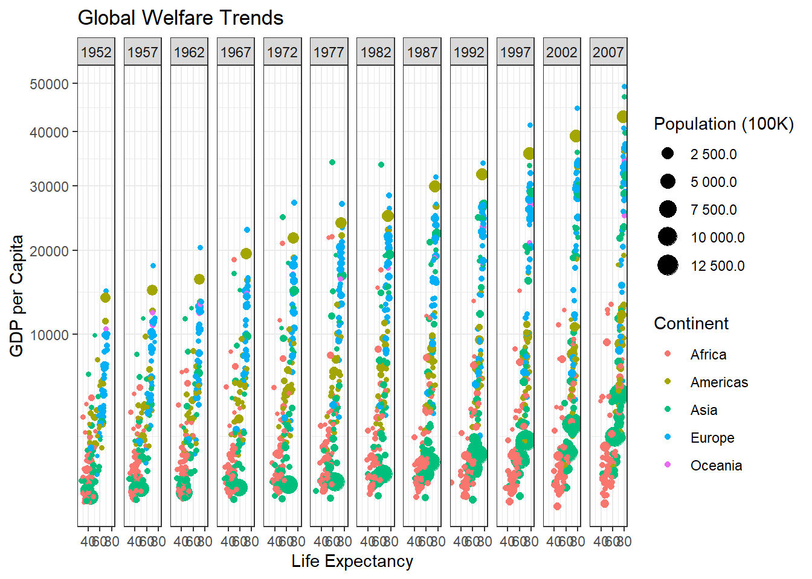

## Gap Minder Data Analysis

The following chart comes from the gap minder data set and shows the welfare of countries through out the years. It high lights the positive trends going on i the world.


::: {.cell}

```{.r .cell-code}
library(tidyverse)
library(gapminder)

gapminder_c <- gapminder %>%
  filter(country != "Kuwait")

ggplot(gapminder_c, aes( x = lifeExp, y = gdpPercap, size = pop, colour = continent)) + 
  scale_y_continuous(trans = "sqrt") +
  geom_point()+
  facet_wrap(~year, nrow = 1)+
  labs(title="Global Welfare Trends", x = "Life Expectancy", y = "GDP per Capita")+
  theme_bw()+
  scale_size_continuous(
    name = "Population (100K)",  
    labels = scales::label_number(scale = 1e-5, accuracy = 0.1)  
  ) +
    guides(
    size = guide_legend(title = "Population (100K)"),  
    color = guide_legend(title = "Continent")  
  )
```

::: {.cell-output-display}
{width=672}
:::
:::
