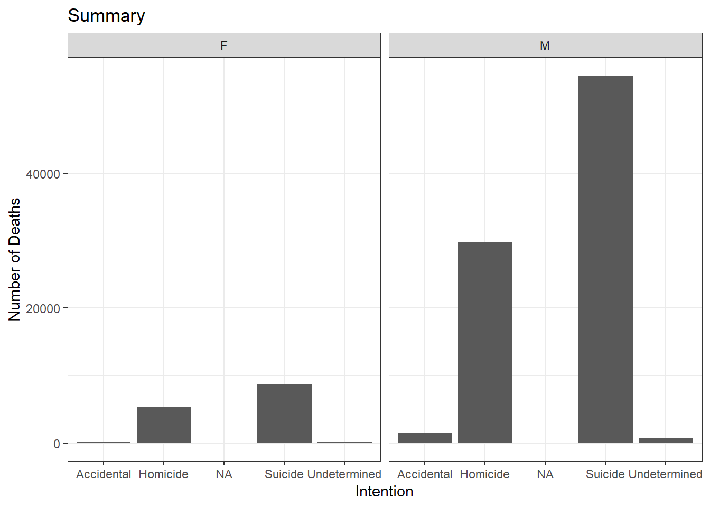
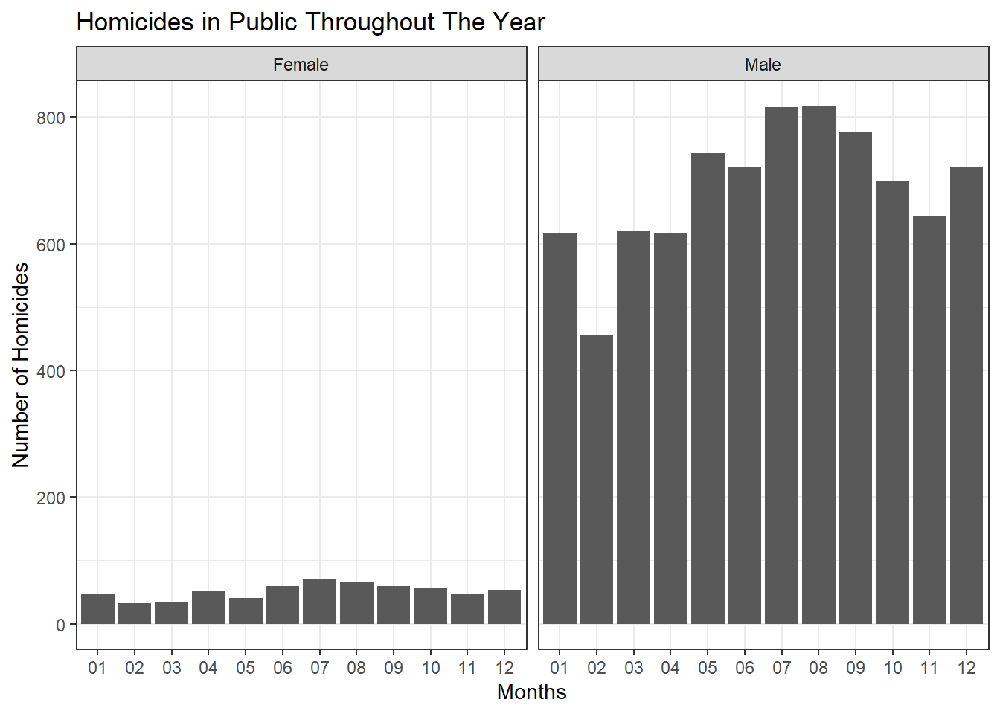
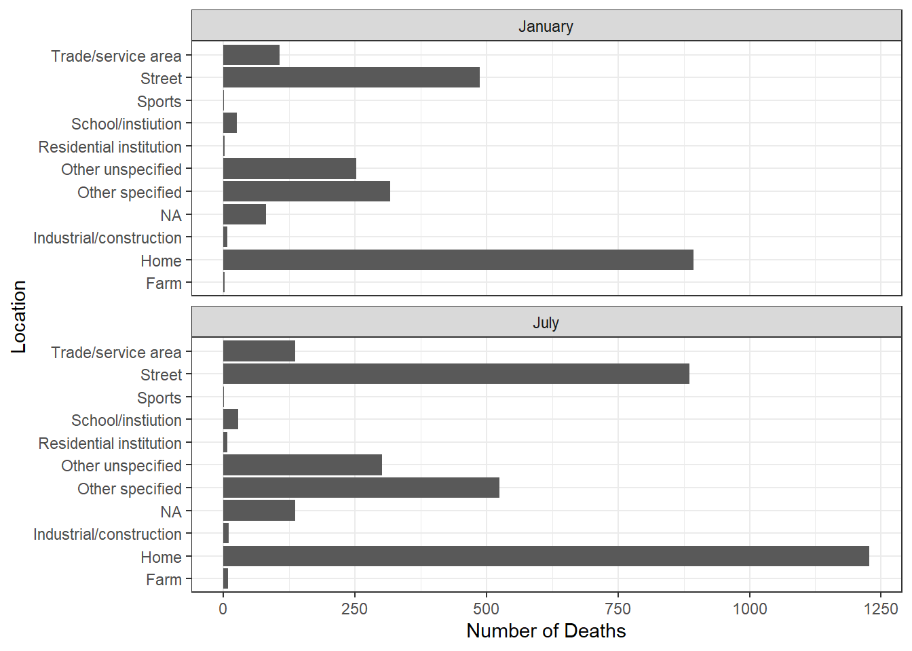

## Gun Death Data

The article addresses the high number of deaths in america. The data set used traces the deaths to many sources but the article alone shows that first and foremost the most common type of gun death is suicide, making up about 2/3 of the death by guns. The second trend the video focused on was the gendered nature of gun deaths. In terms of suicide men were more likely to use firearms in a suicide attempt. On the side of homicide once again men are the victims at higher rates than women.


::: {.cell}

```{.r .cell-code}
library(readxl)
library(tidyverse)

# we download the data set
gun <- read_excel("C:/Users/seanw/Downloads/full_data_gun_n_stuff.xlsx")

# we need a summary of the article

ggplot(gun, aes(x = intent)) +
  geom_bar() +
  facet_wrap(~sex, nrow = 1) +
  theme_bw() +
  labs(title = "Summary", x = "Intention", y = "Number of Deaths")
```

::: {.cell-output-display}
{width=672}
:::

```{.r .cell-code}
gun_Homicide <- gun %>%
  filter(intent == "Homicide",
         place == "Street"
         ) %>%
  mutate(
    Gender = case_when(
      sex == "M" ~ "Male",
      sex == "F" ~ "Female"
    )
  )

ggplot(gun_Homicide, aes(x = month)) +
  facet_wrap(~Gender, nrow = 1)+
  geom_bar() +
  theme_bw() +
  labs(title = "Homicides in Public Throughout The Year",
       x = "Months",
       y = "Number of Homicides")
```

::: {.cell-output-display}
{width=672}
:::
:::


This graph examines the The homicides that take place in public spaces namely the streets. This highlights the the disparity in homicides between men and women while also showing that between the spring and the summer months there is a steady increase in this type of crime.


::: {.cell}

```{.r .cell-code}
gun_suicide <- gun %>%
  filter( month %in% c("02","07"),
          intent == "Homicide") %>%
  mutate(Month = case_when(
          month == "02" ~ "January",
          month == "07" ~ "July"))

ggplot(gun_suicide, aes(y = place)) +
  facet_wrap(~Month, nrow = 2) +
  geom_bar() +
  theme_bw() +
  labs(Title = "Suicides by location", 
       x = "Number of Deaths", 
       y = "Location")
```

::: {.cell-output-display}
{width=672}
:::
:::


This graph is to compare the the months with the highest and lowest homicide rate from the last graph and compare where the change is happening. The first major change is in the home where we see a large spike, the other place is on the streets. This Highlights the seasonal need for additional law inforcment.
