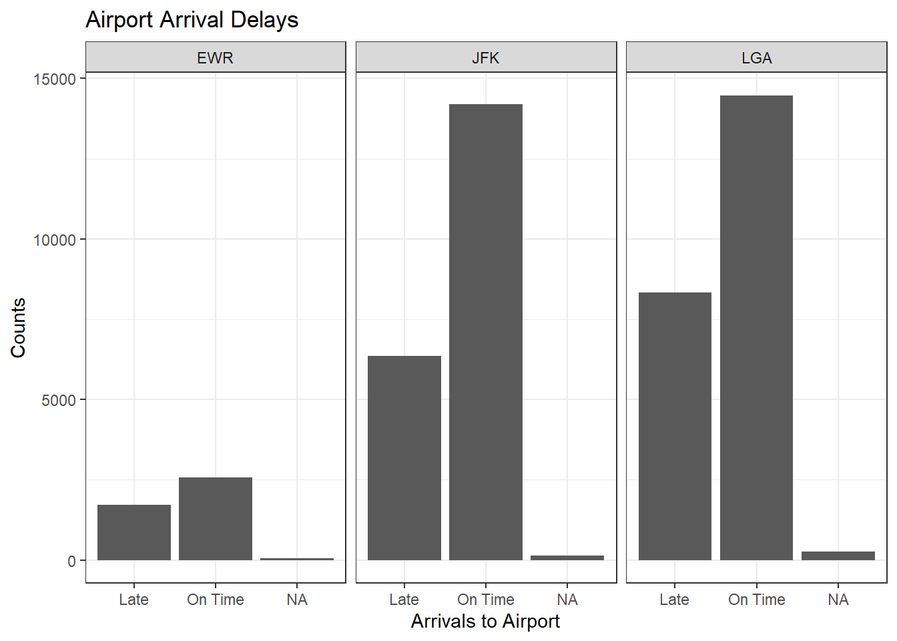
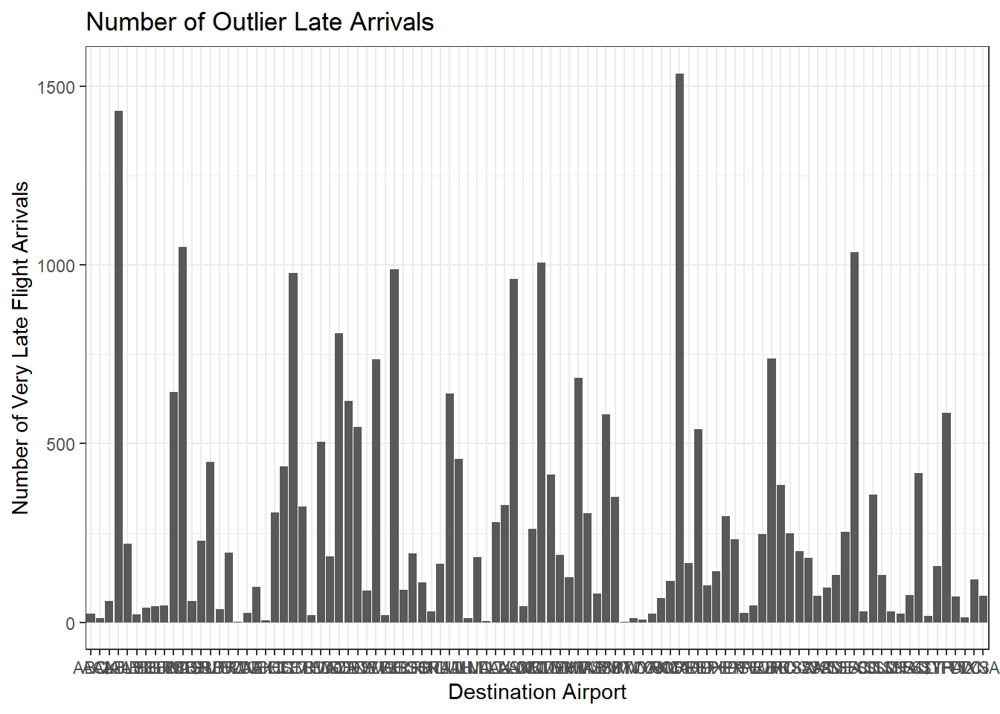

## Wings to Fly


::: {.cell}

```{.r .cell-code}
library(tidyverse)
library(nycflights13)


q1 <- flights %>%
  filter(carrier == "DL") %>%
  mutate(events = case_when(
    arr_delay <= 0 ~ "On Time",
    arr_delay > 0 ~ "Late",
  ))

ggplot(q1, aes(  x = events)) +
  geom_bar()+
  facet_wrap(~origin)+
  theme_bw() +
  labs(title = "Airport Arrival Delays", 
       x = "Arrivals to Airport",
       y = "Counts")
```

::: {.cell-output-display}
{width=672}
:::
:::


The graph above shows us two bars for each delta plane arrival coming from one of three airports. One bar is simply the number of times a flight arrived late while the other is the the number of times that the flight arrived on time. We can see that EWR is doing the worst as the ratio of late to on time arrivals are close to equal. JFK and LGA both show a high number of on time arrivals compared to EWR. If one looks close they will notice that the JFK air port although it has a similar number of on time arrivals, they have a noticeably less late arrivals. Therefor we should choose flights from JFK airport to reduce the chance of having a flight that is arriving late.


::: {.cell}

```{.r .cell-code}
Q1 <- quantile(flights$arr_delay, .25, na.rm = TRUE)
Q3 <- quantile(flights$arr_delay, .75, na.rm = TRUE)

q2 <- flights %>%
  filter( arr_delay > Q3 + 1.5* (Q3 - Q1))
  
ggplot(q2, aes(dest)) +
  geom_bar() +
  theme_bw() +
  labs(title = "Number of Outlier Late Arrivals",
       x = "Destination Airport",
       y = "Number of Very Late Flight Arrivals")
```

::: {.cell-output-display}
{width=672}
:::
:::


In this Graph I look at Airports using the absolute number of outlines. This graph only allows us to compare the number of really long delays between airports. It is important to keep in mind that this doesn't keep track of the percent of "really long" delays. This was done with the understanding that this only looks at the flights leaving from JFK, EWR, and LGA airport. A company looking at this data con see the number of delayed flights and anticipate the hit in approval rating for the company.
